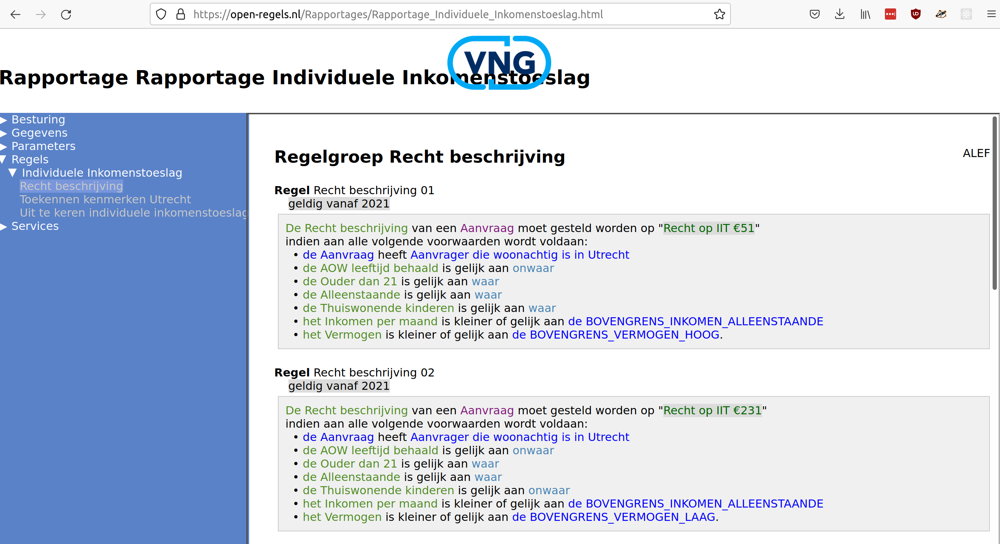

# Toelichting

Bevat testgevallen voor Individuele Inkomenstoeslag zoals gespecificeerd voor de gemeente Utrecht. Informatie hierover in context wordt [hier](https://open-regels.nl/methoden/ALEF/) toegelicht. En dit is de [directe link](https://open-regels.nl/Rapportages/Rapportage_Individuele_Inkomenstoeslag.html) naar de specificatie.

De testgevallen specificeren de volgende attributen:
- woonplaats
- geboortedatum *deze is toegevoegd om waar nodig en/of mogelijk elders de oawLeetijdBehaald en ouderDan21 af te leiden*
- oawLeeftijdBehaald
- ouderDan21
- thuiswonendeKinderen
- inkomenPerMaand
- vermogen

De inhoud van "test" komt overeen met de Regelgroep Recht beschrijving zoals die gespecificeerd is in de specificatie (zie illustratie hieronder).



Het veld "recht", tenslotte, bevat de verwachte uitkomst van de regelservice die we confronteren met het onderhavige testgeval. Het veld "postmanCheck" toont de waarde bij handmatige test op het moment van aanmaken testgevallen.

## Afwijkende testgevallen

De set bevat óók afwijkende testgevallen:

- waar een waarde ontbreekt is deze geen onderdeel van de criteria voor recht beschrijving
- waar een waarde "N/A" is deze bedoeld een test te zijn voor incomplete informatie, allen bedoeld voor Recht beschrijving 01.

## Uitbreiding test data met partners

Aan de test data is een partner set toegevoegd, herkenbaar aan: `"test": "Recht beschrijving 03 - partner 1/2 van 2"`

## Postman

Directe [link](https://vil-regels.nl:8443/engine-rest/decision-definition/key/Decision_18qw2e6/evaluate) voor Postman tests.

Voor testen is Basic Auth met bekende credentials nodig.

Body...

```
{
    "variables": {
        "Woonplaats": {
            "value": "Utrecht",
            "type": "String"
        },
        "aowLeeftijdBehaald": {
            "value": false,
            "type": "Boolean"
        },
        "ouderDan21": {
            "value": true,
            "type": "Boolean"
        },
        "alleenstaande": {
            "value": true,
            "type": "Boolean"
        },
        "thuiswonendeKinderen": {
            "value": true,
            "type": "Boolean"
        },
        "inkomenPerMaand": {
            "value": "1200",
            "type": "Integer"
        },
        "vermogen": {
            "value": "10000",
            "type": "Integer"
        }
    }
}
```